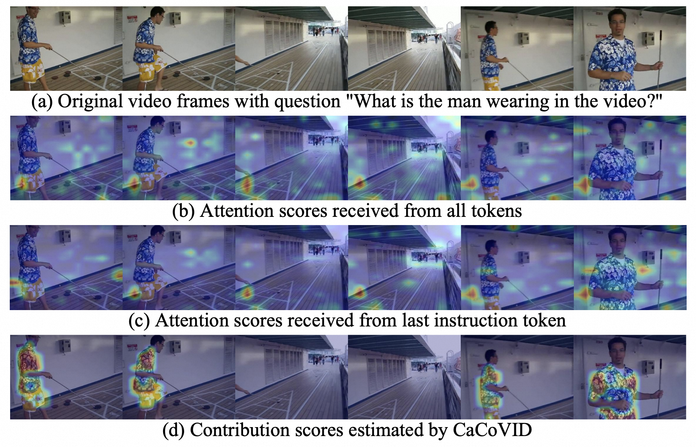
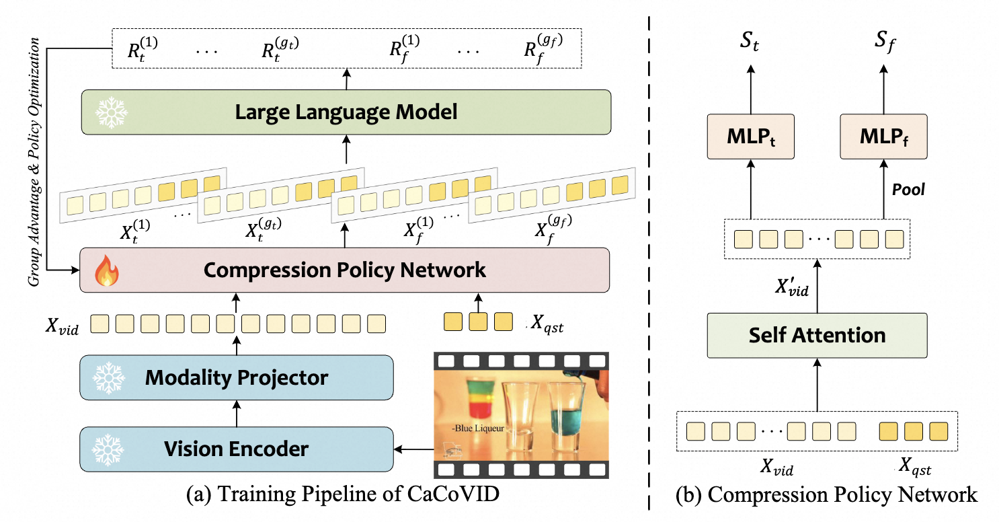
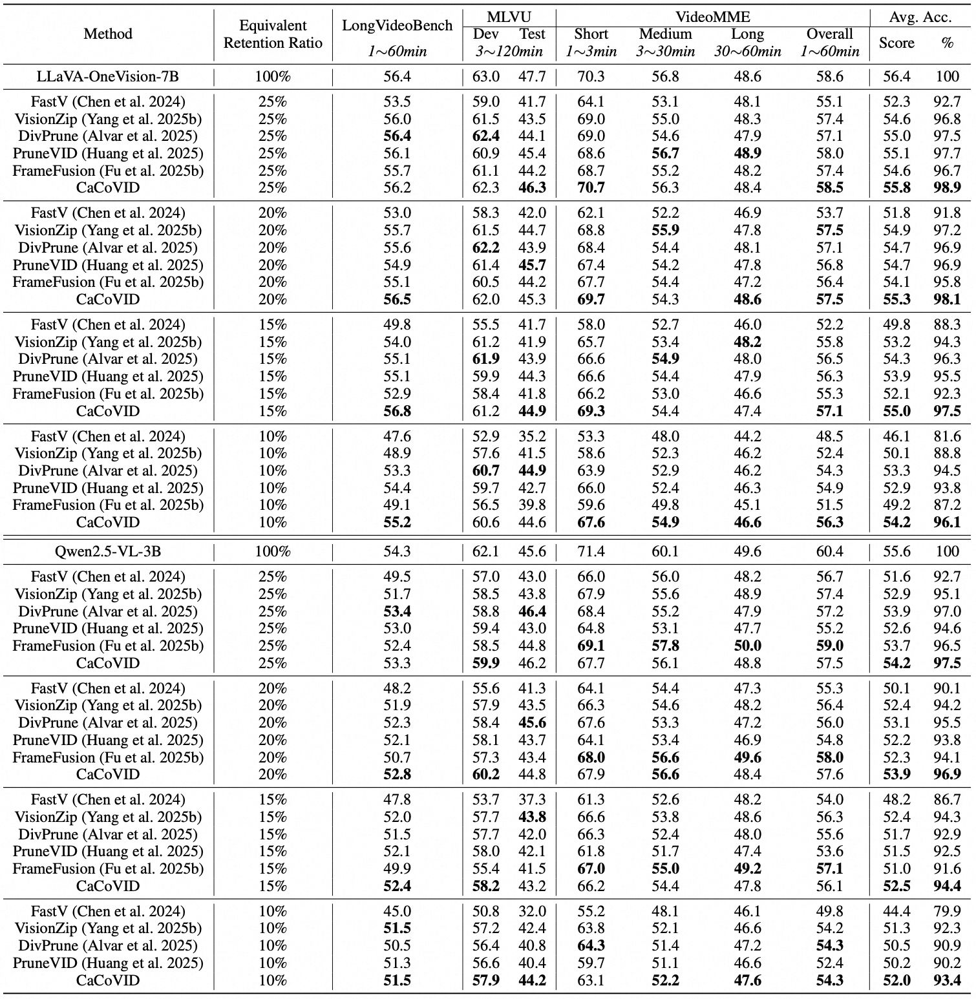
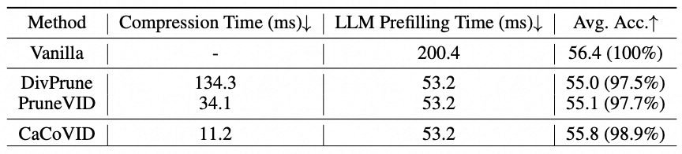
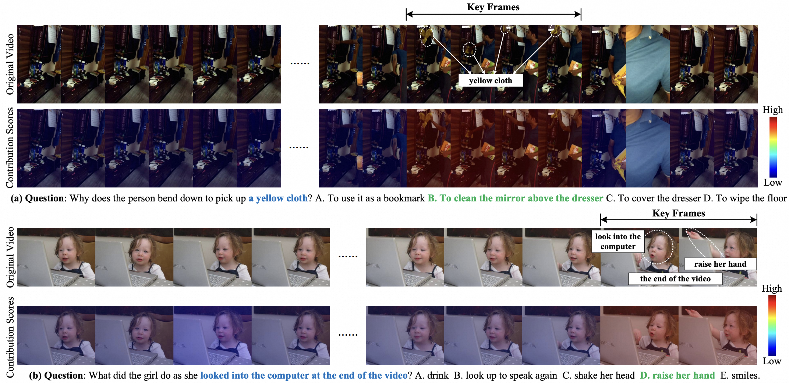
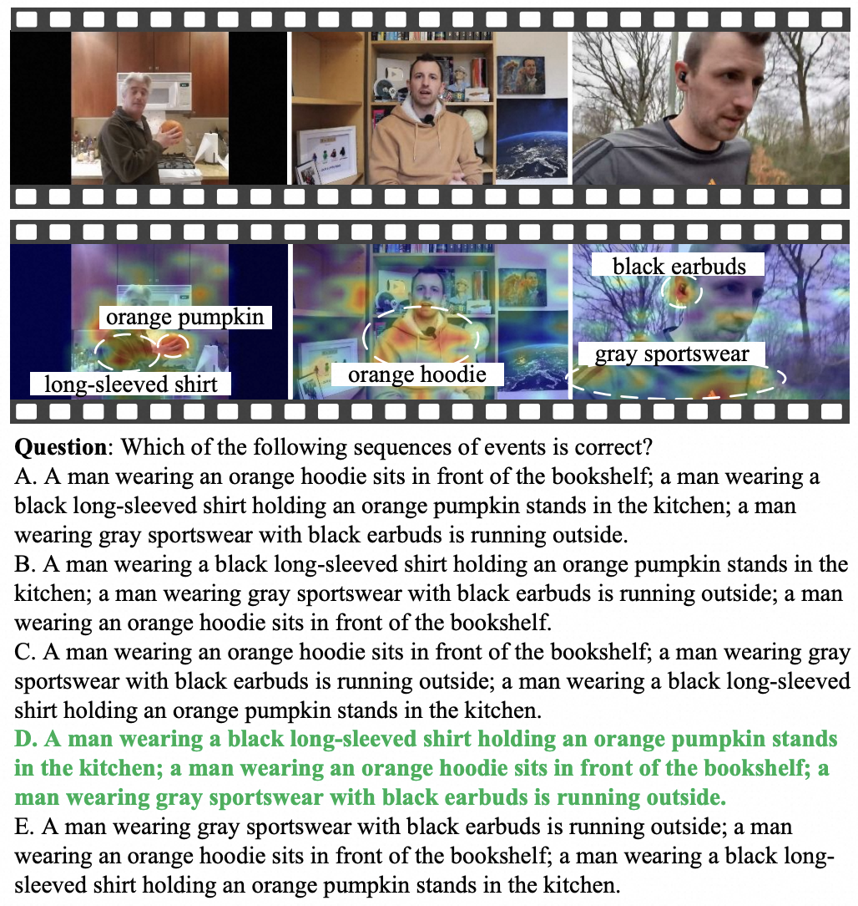

<div align="center">
<h1>CaCoVID: Contribution-aware Token Compression for Video Understanding via Reinforcement Learning</h1>
</div align="center">

<div align="center">
<a href="https://arxiv.org/abs/2602.01649">

</a>
<a href="https://huggingface.co/moraleyc/CaCoVID_LLaVA-OneVision">

</a>
</div align="center">

## 💡 About CaCoVID
Video large language models have demonstrated remarkable capabilities in video understanding tasks. However, the redundancy of video tokens introduces significant computational overhead during inference, limiting their practical deployment. Many compression algorithms are proposed to prioritize retaining features with the highest attention scores to minimize perturbations in attention computations. However, the correlation between attention scores and their actual contribution to correct answers remains ambiguous. To address the above limitation, we propose a novel **C**ontribution-**a**ware token **Co**mpression algorithm for **VID**eo understanding (**CaCoVID**) that explicitly optimizes the token selection policy based on the contribution of tokens to correct predictions. First, we introduce a reinforcement learning-based framework that optimizes a policy network to select video token combinations with the greatest contribution to correct predictions.  This paradigm shifts the focus from passive token preservation to active discovery of optimal compressed token combinations. Secondly, we propose a combinatorial policy optimization algorithm with online combination space sampling, which dramatically reduces the exploration space for video token combinations and accelerates the convergence speed of policy optimization.

## 📌 Highlights
<div align="center">
    
</div>

<div align="center">
    
</div>

1. **Align with Accuracy.** Compared to attention-based pruning strategies, CaCoVID directly optimizes the policy network with feedback from large model predictions, avoiding the potental misalignment between token attention scores and their actual contributions to correct answers.

2. **Question-aware Pruning.** CaCoVID achieves question-aware token pruning by establishing interaction between video tokens and questions.

3. **Simple and Efficient.** The policy network of CaCoVID is simple and efficient, achieving lower pruning latency compared to previous algorithms.

4. **Strong Performance.** CaCoVID can identify the video tokens most critical to answering questions, thereby achieving higher performance at the same compression ratio.


## 🚀 Performance and Efficiency
<div align="center">
    
</div>
CaCoVID directly estimates the contribution of each token to the correct answer with feedback from large models, thereby retaining the most critical video tokens to accurately answer questions.

<br>
<div align="center">
    
</div>
CaCoVID designs a simple and efficient policy network along with effective optimization algorithm to estimate token contribution scores to the correct answer, achieving higher average performance with lower pruning latency.


## 📊 Visualization

<div align="center">
    
</div>

The compression policy network can effectively identify the most critical frames to answer the question, such as the frames when the man picks up a yellow cloth and the frames when the girl looks into the computer at the end of the video.

<br>

<div align="center">
    
</div>

Our compression policy network can handle complex video understanding and identify the most critical tokens relevant to the question, such as orange pumpkin, long-sleeved shirt, orange hoodie and black earbuds.

## 📁 Data Preparation
We use [Video-R1-260k](https://arxiv.org/pdf/2503.21776) as the training set for the polict network optimization. Please download the original video data from [ModelScope](https://modelscope.cn/datasets/Video-R1/Video-R1-data) or [Huggingface](https://huggingface.co/datasets/Video-R1/Video-R1-data).

For some training samples, Video LLMs can output the correct answer even without video input, which can significantly affect training efficiency and stability. Therefore, we filtered out these easy questions through a blind test to construct new training subset ( [Video-R1-llava_onevision_filtered](./data/Video-R1-llava_onevision_filtered.json)) for the optimization of the policy network.

## 🔥 Training
### Installation
Use the following script to set up the environment for CaCoVID training.
```
sh src/scripts/install.sh
```

### Start Training
Use the following script to start CaCoVID training.
```
sh src/scripts/run_llava_onevision.sh
```

The default parameters in the training scripts are the recommended configuration. ```VIDEO_ROOT``` in the scripts needs to be specified as the local video storage path.

## 🧪 Evaluation
### Installation
We use [LMMs-Eval](https://github.com/EvolvingLMMs-Lab/lmms-eval) framework to evaluate the performance of models.
Use the following script to set up the environment for model evaluation.
```
cd lmms_eval
sh scripts/install.sh
```

### Start Evaluation
Use the following script to start model evaluation.
```
sh scripts/eval_llava_onevision.sh
```

The default parameters in the training scripts are the recommended configuration. ```PRETRAINED``` in the scripts needs to be specified as the trained model path.

## ✏️ Acknowledgements
+ Thanks for [Video-R1](https://github.com/tulerfeng/Video-R1) and [Open-R1](https://github.com/huggingface/open-r1) Library, which helps us to quickly implement our ideas.
+ Thanks for the contributions of the open-source community ([Qwen2.5-VL](https://github.com/QwenLM/Qwen2.5-VL), [LLaVA-OneVision](https://github.com/LLaVA-VL/LLaVA-NeXT)).

## 📦 Citation
If our work is useful for your research, please consider citing as follows:

```
@misc{ma2026contributionawaretokencompressionefficient,
      title={Contribution-aware Token Compression for Efficient Video Understanding via Reinforcement Learning}, 
      author={Yinchao Ma and Qiang Zhou and Zhibin Wang and Xianing Chen and Hanqing Yang and Jun Song and Bo Zheng},
      year={2026},
      eprint={2602.01649},
      archivePrefix={arXiv},
      primaryClass={cs.CV},
      url={https://arxiv.org/abs/2602.01649}, 
}
```